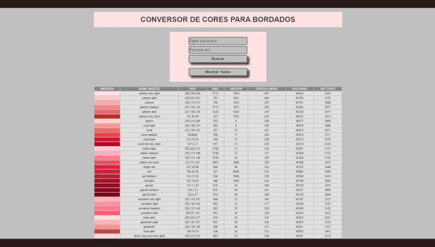

<p align="center">
  <a href="https://devfel.com/" rel="noopener">
 </a>
</p>

<h1 align="center">Conversor de Meada para Bordados</h1>
<h3 align="center"> 🔗 Teste a aplicação aqui: https://devfel.github.io/convertermeada/ </h3>
<h4 align="center"> 🌎 For an English Version go here: https://github.com/devfel/convertfloss</h4>

<div align="center">

[]()
[](/LICENSE)

</div>

---

<p align="center"> 
Um aplicativo real usado por profissionais do bordado para converter meadas (também conhecido como fios) de uma marca para outra. O site também pode ser usado para encontrar uma cor específica e procurar o código que as empresas usam. Criado do zero de forma responsiva e com arquivo JSON próprio para armazenar dados.
  <p align="center">
    </a>
  </p>

---

## 📝 Table of Contents

- [Teste](#live)
- [Funcionalidades](#features)
- [Copiando o projeto](#getting_started)
- [Dependências](#dependencies)
- [Tecnologias Utilizadas](#built_using)
- [Agradecimentos](#acknowledgements)
- [Licença](#licenses)
- [Autores](#authors)

---

## 🕹 Test Here <a name = "live"></a>

https://devfel.github.io/convertermeada/

---

## 🧐 Funcionalidades <a name = "features"></a>

- **_Listar todas as cores e meadas:_** Botão para listar a tabela completa com todas as cores e códigos de fios e meadas.
- **_Pesquisar pelo nome da cor:_** Opção de procurar um fio pelo nome da cor. É possível, por exemplo, procurar uma cor e encontrar todos os seus tons.
- **_Busca por código de marca:_** Se você selecionar uma marca e inserir um número de código para essa marca, o sistema filtrará e mostrará todos os códigos correspondentes para as outras marcas de linha que combinem com a cor buscada.

---

## 🏁 Copiando o projeto <a name = "getting_started"></a>

Por conta deste site ter sido feito usando apenas HTML, CSS e JavaScript, ele pode ser replicado facilmente em seu próprio navegador sem muitos problemas, basta clonar o projeto e executá-lo.

Você pode clonar o repositório por meio do Prompt de Comando ou Terminal apenas digitando o seguinte:

```sh
git clone https://github.com/devfel/convertfloss.git
```

outra opção é fazer o download do arquivo zip atráves do botão verde chamado **"Code"**.

---

## 🔁 Dependências <a name = "dependencies"></a>

Este projeto foi desenvolvido com Vanilla Javascript, Css e HTML e portanto não necessita de dependências ou instalações extras.

---

## ⛏️ Tecnologias Utilizadas <a name = "built_using"></a>

- [JavaScript](https://www.javascript.com/) - Programming Language
- [HTML](https://pt.wikipedia.org/wiki/HTML) - Markup Language
- [CSS](https://en.wikipedia.org/wiki/CSS) - Style Sheets
- [JSON](https://www.json.org/json-en.html) - Object Notation

---

## 🎉 Agradecimentos <a name = "acknowledgements"></a>

- Arquivo JSON criado baseado na tabela da [DMC CrazyArtZone](http://dmc.crazyartzone.com/index.asp).

---

## 📝 Licença <a name = "licenses"></a>

- Distribuido sob a licença MIT - veja o arquivo [LICENSE.md](https://github.com/devfel/convertermeada/blob/master/LICENSE.md) para mais detalhes.

---

## ✍️ Autores <a name = "authors"></a>

- [@devfel](https://devfel.com/) - Luiz Flávio Felizardo
